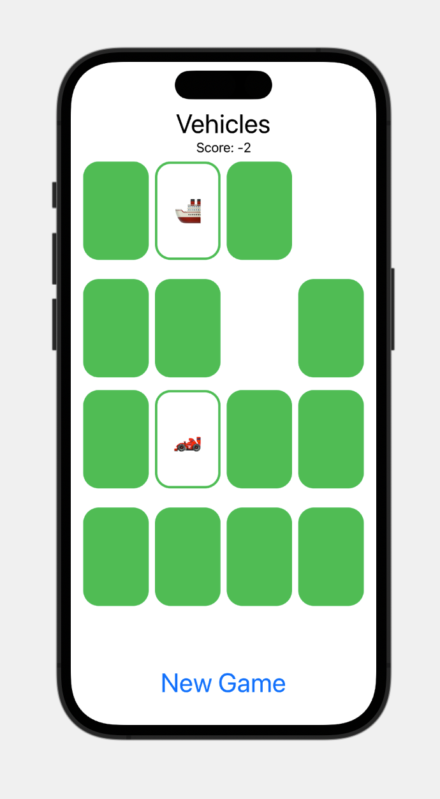
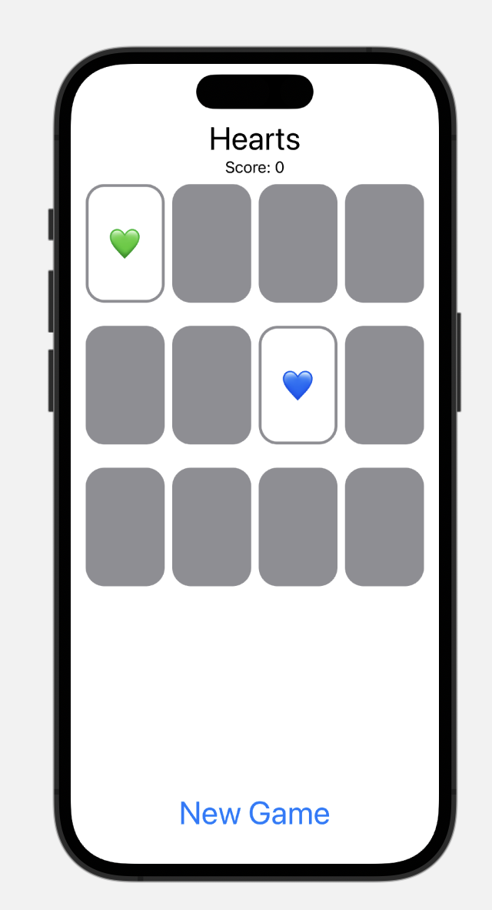

# Memorize Game App

The Memorize Game App is an iOS mobile application developed using SwiftUI and MVVM architecture. It provides an engaging memory-based game where users can switch between different themes and track their overall score throughout the game.

## Features

- Interactive user interface built with SwiftUI for a smooth and intuitive gaming experience.
- MVVM architecture for separation of concerns, enhancing maintainability and testability.
- Theme switching functionality allows users to choose different themes for customized game experiences.
- Score tracking system displays the user's overall score in real-time during gameplay.

## Screenshots

## Requirements

- iOS 14.0+
- Xcode 12.0+
- Swift 5.5+

## Getting Started

1. Clone the repository:
git clone https://github.com/jli943/memorize-game-app.git

2. Open the project in Xcode.

3. Build and run the app on a simulator or physical device.

## Contributions

Contributions are welcome! If you find any issues or want to enhance the app, feel free to submit a pull request.
